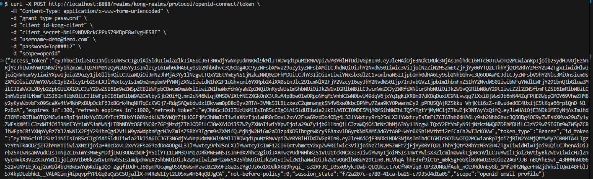

step 1: docker compose up -d

http://localhost:8888/admin/master/console/

user: admin
password: admin

Click in Manage realms

Click in Create realm

Click in Criar

in sidebar click in Clientes

Click in create client

Click in Next

Selecione exatamente essas opções, após clique em Next

Aqui é so salver

Criar novo usuario, clique em create new user

clique em criar para salvar

resultado

clique em credentials para criar uma senha:

sempre lembrar de desmarcar o temporario na senha e so salvar

chamada pra obter token de accesso do keycloak

url konga: http://localhost:1337/#!/dashboard

adicionar plugin

salvar pra adicionar plugin

adicionar um serviço: add new serviçe

pra salvar so clicar em submit service

cadastrar consumer

-----BEGIN PUBLIC KEY-----
MIIBIjANBgkqhkiG9w0BAQEFAAOCAQ8AMIIBCgKCAQEAqm2zZnQ4QVzaKY4XtGIanF5FzyEuoc5Yan7n2KwTRHuwQh3giYxBC2jHYKBA8Nq/6KrIb8DnQdE0snpMC0XBi3AwlG3QmtH2Sp9CKAhUOp5gQG6xm8KaUaEe9XLiNo8wOOniC/1b0BT2pZz7STKXpjdcmsSINgtS82lGfLFGlQc7pguBzz98dFePdV3oHlr/cx1riV1WoCu24EW5+4ckBzQ+ziUW8l1O6QxknHhVkGIxj5juHyb/cKGohOBiOxlBoG8C+kKqV2se2dNi4DptWgPUWDMsv1Zh8T8mOORAjtRPktmdrhY2DfHC+XN39XNApx0/iasEEWKWM0j8GEsPTwIDAQAB
-----END PUBLIC KEY-----

